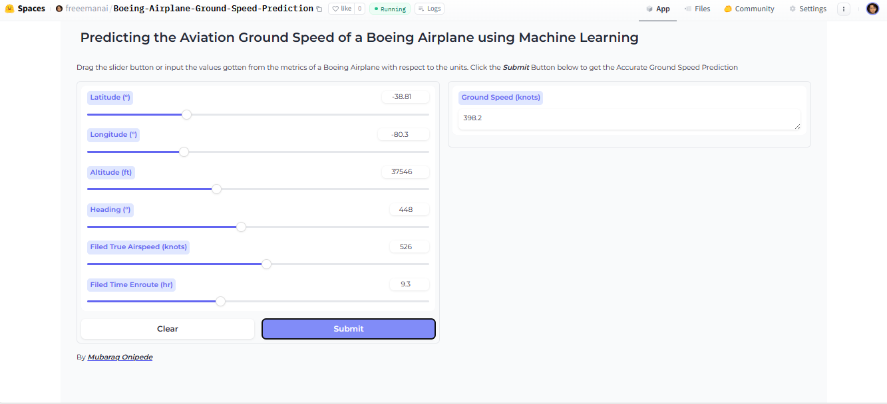

    <h1>Ground Speed Prediction of a Boeing Airplane</h1>
    <strong>An end-to-end machine learning project encompasses tasks such as data cleaning, augmentation, wrangling, modeling, deployment, and evaluation of solutions to establish a functional system</strong>
     

 

### Data Collection
Data was gotten from the [AviationAPI](https://docs.aviationapi.com/#tag/VATSIM), a live API specifically designed to fetch relevant information such as charts, chart changes, weather, etc., at 28-day intervals.

### Data Processing
After Data Collection, I conducted thorough cleaning, analysis, and visualization using Python libraries including:
- pandas
- missingno
- matplotlib
- seaborn

### Model Development
I built a Linear Regression model using the Scikit-learn library to predict the ground speed of Boeing aircraft. The model achieved an accuracy of 83.3% and a Mean Squared Error (MSE) of 5013 units. However, I am actively seeking to enhance the model's performance for more accurate predictions and lower error rates.

### Model Deployment
The trained model was deployed on the Hugging Face platform using Gradio for convenient access and interaction. Here is the [link](https://huggingface.co/spaces/freeemanai/Boeing-Airplane-Ground-Speed-Prediction) for live testing.  

### Article
I am working on an article which encapsulates my thought process behind the project, from data retrieval via API to the creation of an AI system for predicting ground speed in Boeing aircraft.

### Note

- [ ] A negative value in your ground speed prediction indicates that the aircraft is moving in the opposite direction of the expected or desired course 
    
- [ ] I am also working on an API documentation for Python and Javascript developers where they can make API calls through my endpoints to carry out predictions.

📫Please send a message [here](mailto:mubaraqgbolahan014@gmail.com) or [here](https://www.linkedin.com/in/mubaraq-onipede-05562b189/), if you have a contribution and find it useful.
